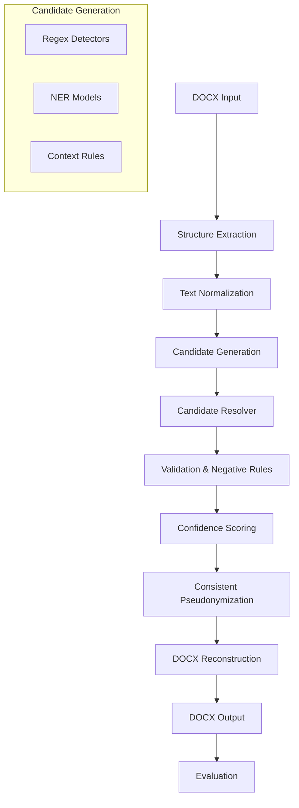

# PII Redaction Tool

A Python-based PII (Personally Identifiable Information) redaction and pseudonymization tool designed to read DOCX documents, detect sensitive entities, replace them with consistent fake alternatives (pseudonyms), generate a redacted DOCX file, and evaluate precision, recall, and accuracy.

## Current Project Status

> [!NOTE]
> **Status:** Project Initialized (Commit 1).
> Currently, the core project structure and basic configurations have been set up. **PII detection, DOCX processing, and redaction features have NOT been implemented yet.** These functionalities will be added incrementally in subsequent commits.

## Planned High-Level Architecture

The tool is planned to process data through the following pipeline:

### Detailed Pipeline Steps
1. **DOCX Input**: The source document containing potentially sensitive information.
2. **Structure Extraction**: Extract text, paragraphs, tables, and style structure from the DOCX file.
3. **Text Normalization**: Clean and normalize text encoding to prepare for detection.
4. **Candidate Generation**: Identify potential PII candidates using regular expressions, Named Entity Recognition (NER), and contextual rules.
5. **Candidate Resolver**: Resolve overlapping or conflicting candidates.
6. **Validation + Negative Rules**: Filter out false positives using validation checks (e.g., checksums for credit cards or SSNs) and negative rules.
7. **Confidence Scoring**: Assign a confidence score to each PII candidate.
8. **Consistent Pseudonymization**: Replace each detected PII with a consistent fake alternative (e.g., mapping a specific real name to the same pseudonym throughout the document).
9. **DOCX Reconstruction**: Write the pseudonymized text back into the original DOCX layout and formatting.
10. **Evaluation**: Compute precision, recall, and F1-score of the detection models.

## Planned PII Categories

The tool will support detecting and redacting/pseudonymizing the following categories of PII:
- **Full names**
- **Email addresses**
- **Phone numbers**
- **Company names**
- **Physical/mailing addresses**
- **SSNs (Social Security Numbers)**
- **Credit card numbers**
- **Dates of birth**
- **IP addresses**
